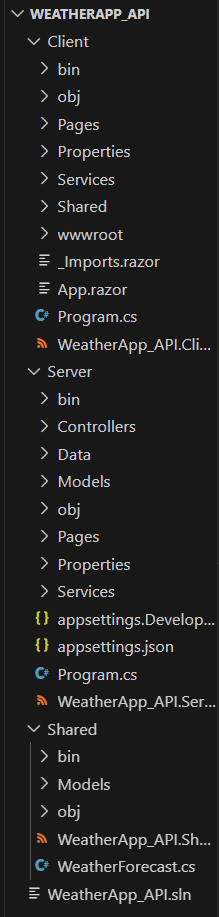

# 🌤️ WeatherApp - Blazor WebAssembly Project

WeatherApp is a web-based application built using Blazor WebAssembly that allows users to:

- View current weather using the OpenWeatherMap API.
- Save and manage their favourite city and weather preference.
- Proper modification and clearance of data
- Get weather notifications based on preferences.

---

## 🔧 Features

- User account creation and authentication (JWT-based).
- Weather data fetched from OpenWeatherMap (Current Weather API).
- Favorites stored and managed in MongoDB.
- Responsive UI with protected routes for authenticated users.
- Clean layout and user-friendly interactions.

---

## 🧩 Tech Stack

- **Blazor WebAssembly** (.NET 6)
- **ASP.NET Core Web API**
- **MongoDB** for user and weather data
- **OpenWeatherMap API** (Basic plan)
- **JWT Authentication**
- **Blazored.LocalStorage** for token handling

---

## 🚀 How to Run

### 1. Clone the Repository

```bash
git clone https://github.com/yourusername/WeatherApp.git
cd WeatherApp
```
### 2. Set Up MongoDB

- Ensure MongoDB is installed and running locally or on a cloud instance.
- Create a database named `Blazors`.
- Inside the database, create the following collections:
  - `WUsers` — for storing user login details and favorite city/weather preferences.
  - `WeatherData` — for storing static 5-day weather data manually.

#### Sample `WeatherData` document structure:

```json
{
  "City": "London",
  "Date": "2024-07-28T00:00:00Z",
  "Temperature": 24,
  "Description": "Cloudy"
}
```

---

### 3. Configure appsettings.json (in Server project)

```json
{
  "Jwt": {
    "Key": "your-secret-key"
  },
  "ConnectionStrings": {
    "MongoDb": "mongodb://localhost:27017"
  },
  "OpenWeatherMap": {
    "ApiKey": "your_openweathermap_api_key"
  }
}
```

Replace:

- "your-secret-key" with a long, random secure key.
- "your_openweathermap_api_key" with your API key from [OpenWeatherMap](https://openweathermap.org/)

---

### 4. Build and Run the App

```bash
dotnet build
dotnet run --project WeatherApp.Server
```

### 5. 📁 Project Structure


---